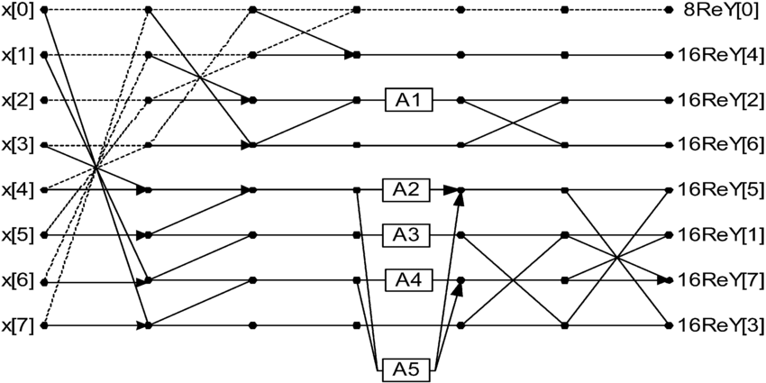

# DCT-Vaaman: AAN-based Discrete Cosine Transform Integrated with RAH

## 📖 Overview
This project implements an **8-point 1D Discrete Cosine Transform (DCT)** using the  
**AAN (Arai–Agui–Nakajima) method**, integrated with the **RAH** on FPGA.

## 🧮 About the AAN Method

The **AAN (Arai–Agui–Nakajima) method** is a fast algorithm for computing the 
**8-point Discrete Cosine Transform (DCT)**.  

### 🔑 Key Advantages:
Traditional DCT implementations require many multiplications, which are costly in FPGA  
or ASIC designs. The AAN method simplifies the computation by factoring and reusing  
common terms, **reducing the number of multiplications dramatically**.

### 🔹 AAN Flow Diagram


*The flow diagram shows butterfly operations and scaling factors used in the AAN algorithm.*

## ⚡ Features
- 8-point 1D DCT (scalable to 2D for image transforms).
- Based on **AAN algorithm**: eliminates multipliers.
- Pipelined design for performance.

## 📊 Resource Utilization (with RAH)

| Resource         | Usage   |
|------------------|---------|
| LUTs             | 34,660  |
| Memory Blocks    | 69      |
| Multipliers      | 0       |


## 🚀 Performance

- **Clock Frequency**: 70 MHz  
- **Pipeline Latency**: 44 cycles 

---

## 📝 Test Scripts

To validate the **8-point 1D DCT (AAN method)** design, two C scripts are provided:

### 1. Interactive Decimal Input
- Allows the user to manually enter **8 decimal numbers** (corresponding to the 8-point DCT input).
- The script computes and displays the DCT output for the given values.

**Example Run:**
```bash
$ gcc dct.c -o dct
$ ./dct 52, 55, 61, 66, 70, 61, 64, 73
```

### 2. File-based Input/Output
   - Reads an **input file** containing `512` frames, each with **8 decimal input values**.
   - Automatically computes the DCT for all frames and generates an **output file** containing `512` corresponding DCT outputs.

   **Example Run:**
```bash
$ gcc dct_file.c -o dct_file
$ ./dct_file input.txt output.txt
```
These scripts make it easier to test the hardware design with both **custom single-frame inputs** and **batch test vectors**.

### 3.RAHComm Input (Hexadecimal Frames)
   -  If you want to provide inputs via rahcomm, send the data as 32-bit numbers.
   -  Each frame consists of 8 values, and each value is given in IEEE-754 floating-point (hex) format.

   **Example (one frame with 8 values)**:
   ```
   00 00 42 92 00 00 
   00 00 42 80 00 00
   00 00 42 74 00 00
   00 00 42 8c 00 00 
   00 00 42 84 00 00 
   00 00 42 74 00 00 
   00 00 42 5c 00 00 
   00 00 42 50 00 00
   ```
   Each line represents one 32-bit number in a frame.
   8 such numbers together form one complete input frame.
## RAH Protocol User Guide - Resources

For further details on how to use the RAH protocol, you can refer to the following guides:

1. **[CPU Usage Guide](docs/cpu-usage-guide.md)**:  
   This guide will provide detailed instructions on how to set up and use the RAH protocol on the CPU side, including configuration, data encapsulation, and integration with CPU applications.

2. **[FPGA Implementation Guide](docs/fpga-implementation.md)**:  
   This guide covers the FPGA side of the RAH protocol, explaining how to implement the RAH design, decode data frames, and manage the FIFO buffers for both write and read cycles.

3. **[RAH Example Integration](docs/rah-example-integration.md)**:  
   This document provides a step-by-step example of integrating the RAH protocol between the CPU and FPGA, demonstrating the complete flow from data generation on the CPU to processing on the FPGA and back.


